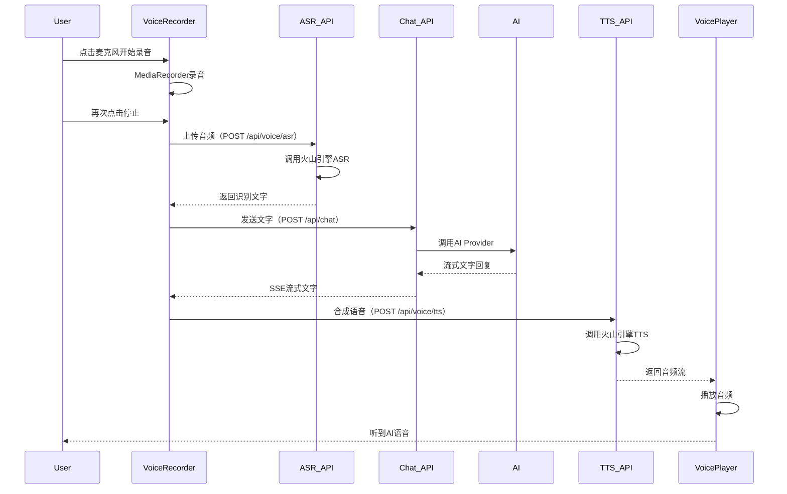

# Design Document - 智能体语音对话功能

## Overview

本设计文档描述了如何在PONT-PONTA平台中集成火山引擎语音服务，为智能体对话系统添加语音输入（ASR）、语音输出（TTS）和端到端语音通话能力。设计遵循模块化、可扩展的原则，确保不破坏现有文字对话功能，同时支持Coze和OpenAI Compatible两种AI Provider。

## Steering Document Alignment

### Technical Standards (tech.md)

**遵循项目技术规范:**
- 使用Next.js 16的App Router和Server Components
- 采用TypeScript严格类型检查
- 遵循React Hooks最佳实践（自定义hooks封装逻辑）
- 使用shadcn/ui组件库保持UI一致性
- API路由遵循RESTful设计原则

**代码风格:**
- 函数式组件和React Hooks
- Async/Await异步处理
- 错误边界和优雅降级
- 详细的TypeScript接口定义

### Project Structure (structure.md)

**新增目录结构:**
```
lib/
  providers/
    voice-provider.ts           # 语音服务抽象接口
  volcengine/                   # 火山引擎SDK封装
    asr.ts                       # 语音识别（Speech-to-Text）
    tts.ts                       # 语音合成（Text-to-Speech）
    auth.ts                      # 火山引擎API签名认证
    types.ts                     # 火山引擎类型定义
components/chat/
  VoiceRecorder.tsx              # 语音录音组件
  VoicePlayer.tsx                # 语音播放组件
  VoiceCallButton.tsx           # 端到端语音通话按钮
hooks/
  useVoiceRecorder.ts           # 录音逻辑Hook
  useVoicePlayer.ts             # 播放逻辑Hook
  useVoiceCall.ts               # 端到端通话Hook
app/api/voice/
  asr/
    route.ts                     # POST /api/voice/asr（语音识别）
  tts/
    route.ts                     # POST /api/voice/tts（语音合成）
```

## Code Reuse Analysis

### Existing Components to Leverage

**1. lib/ai-provider.ts (AI Provider接口)**
- **How it will be used:** 保持现有接口不变，语音功能作为独立模块与AI Provider协作
- **Integration:** 文字→语音转换在客户端处理，AI Provider无感知

**2. app/api/chat/route.ts (聊天API)**
- **How it will be used:** 无需修改，继续提供SSE流式文字响应
- **Integration:** 前端收到文字后可选择是否调用TTS

**3. components/chat/ChatInterface.tsx (聊天界面)**
- **How it will be used:** 扩展现有界面，添加语音控制按钮
- **Integration:** 在输入框右侧添加麦克风和通话按钮

**4. lib/jwt.ts (JWT认证)**
- **How it will be used:** 语音API端点需要验证用户身份
- **Integration:** 复用现有token验证逻辑

### Integration Points

**1. 前端录音 → API识别 → 发送给AI**
```
VoiceRecorder → /api/voice/asr → 文字 → /api/chat → AI回复
```

**2. AI回复 → TTS合成 → 前端播放**
```
/api/chat (文字) → /api/voice/tts → 音频 → VoicePlayer
```

**3. 端到端语音通话模式**
```
麦克风 → ASR → 文字 → AI → 文字 → TTS → 音频播放（循环）
```

**4. 数据库/存储:**
- 语音数据**不持久化**（仅临时内存处理）
- 用户语音偏好设置可存储到`User`表的`preferences`字段（JSON）

## Architecture

### 整体架构设计

采用**客户端录音 + 服务端处理**的混合架构：

```
┌─────────────────────────────────────────────────────────┐
│                      Frontend (Next.js)                  │
├─────────────────────────────────────────────────────────┤
│  ChatInterface                                           │
│  ├─ VoiceRecorder (录音组件)                            │
│  ├─ VoicePlayer (播放组件)                              │
│  └─ VoiceCallButton (通话按钮)                           │
└─────────────────────────────────────────────────────────┘
                          │
                          ▼
┌─────────────────────────────────────────────────────────┐
│                  API Layer (Next.js API Routes)          │
├─────────────────────────────────────────────────────────┤
│  /api/voice/asr  → 火山引擎语音识别                      │
│  /api/voice/tts  → 火山引擎语音合成                      │
└─────────────────────────────────────────────────────────┘
                          │
                          ▼
┌─────────────────────────────────────────────────────────┐
│           Service Layer (VolcEngine SDK)                 │
├─────────────────────────────────────────────────────────┤
│  VolcEngineASR      (流式语音识别)                       │
│  VolcEngineTTS      (流式语音合成)                       │
│  VolcEngineAuth     (API签名认证)                        │
└─────────────────────────────────────────────────────────┘
                          │
                          ▼
┌─────────────────────────────────────────────────────────┐
│            External APIs (火山引擎)                       │
├─────────────────────────────────────────────────────────┤
│  https://openspeech.bytedance.com/api/v2/asr            │
│  https://openspeech.bytedance.com/api/v1/tts            │
└─────────────────────────────────────────────────────────┘
```

### 模块化设计原则

**1. Single File Responsibility:**
- `lib/volcengine/asr.ts` - 仅负责语音识别逻辑
- `lib/volcengine/tts.ts` - 仅负责语音合成逻辑
- `components/chat/VoiceRecorder.tsx` - 仅负责录音UI和交互

**2. Component Isolation:**
- VoiceRecorder可独立使用（无需依赖ChatInterface）
- VoicePlayer可独立使用（可用于其他场景）
- 语音API端点独立（不与其他业务耦合）

**3. Service Layer Separation:**
- API层处理HTTP请求/响应
- Service层封装火山引擎SDK
- UI层通过hooks调用service

**4. Utility Modularity:**
- `lib/volcengine/auth.ts` - 签名算法独立
- `lib/volcengine/types.ts` - 类型定义统一
- `hooks/useVoiceRecorder.ts` - 录音逻辑封装

### 数据流设计



## Components and Interfaces

### Component 1: VolcEngineASR (语音识别服务)

**文件:** `lib/volcengine/asr.ts`

**Purpose:** 封装火山引擎语音识别API，提供流式识别能力

**Interfaces:**
```typescript
interface ASRConfig {
  appId: string
  accessKeyId: string
  secretAccessKey: string
  language?: 'zh-CN' | 'en-US'
  format?: 'pcm' | 'wav' | 'opus'
  sampleRate?: 16000 | 8000
}

interface ASRResponse {
  requestId: string
  text: string
  isFinal: boolean
}

class VolcEngineASR {
  constructor(config: ASRConfig)
  async recognize(audioBuffer: ArrayBuffer): Promise<string>
  private async signRequest(method: string, uri: string): Promise<string>
}
```

**Dependencies:**
- `lib/volcengine/auth.ts` - API签名
- `lib/volcengine/types.ts` - 类型定义
- 内置`crypto`模块 - HMAC-SHA1签名
- 内置`axios`或`fetch` - HTTP请求

**Reuses:**
- 复用现有环境变量（`VOLCENGINE_*`）
- 复用现有错误处理模式

### Component 2: VolcEngineTTS (语音合成服务)

**文件:** `lib/volcengine/tts.ts`

**Purpose:** 封装火山引擎语音合成API，提供流式TTS能力

**Interfaces:**
```typescript
interface TTSConfig {
  appId: string
  accessKeyId: string
  secretAccessKey: string
  voiceType?: 'zh_female_shuangkuaisisi_moon_bigtts' // 默认音色
  speed?: number // 语速（0.5-2.0）
  volume?: number // 音量（0-100）
  format?: 'mp3' | 'wav' | 'opus'
}

interface TTSResponse {
  audioStream: ReadableStream
  format: string
}

class VolcEngineTTS {
  constructor(config: TTSConfig)
  async synthesize(text: string): Promise<Buffer>
  private async signRequest(method: string, uri: string): Promise<string>
}
```

**Dependencies:**
- `lib/volcengine/auth.ts` - API签名
- 内置`crypto`模块 - HMAC-SHA1签名
- 内置`axios`或`fetch` - HTTP请求

**Reuses:**
- 复用现有环境变量（`VOLCENGINE_*`）
- 复用现有错误处理模式

### Component 3: VoiceRecorder (语音录音组件)

**文件:** `components/chat/VoiceRecorder.tsx`

**Purpose:** 提供浏览器录音功能，调用ASR API转换为文字

**Interfaces:**
```typescript
interface VoiceRecorderProps {
  onTextRecognized: (text: string) => void
  onError?: (error: Error) => void
  maxDuration?: number // 最大录音时长（秒）
}

interface VoiceRecorderState {
  isRecording: boolean
  duration: number
  audioLevel: number // 实时音量（0-100）
}

const VoiceRecorder: React.FC<VoiceRecorderProps>
```

**Dependencies:**
- `hooks/useVoiceRecorder.ts` - 录音逻辑Hook
- `app/api/voice/asr/route.ts` - 语音识别API
- `sonner` - Toast通知

**Reuses:**
- 复用现有UI组件库（shadcn/ui的Button、Tooltip）
- 复用现有toast通知模式

### Component 4: VoicePlayer (语音播放组件)

**文件:** `components/chat/VoicePlayer.tsx`

**Purpose:** 播放TTS生成的语音，提供播放控制

**Interfaces:**
```typescript
interface VoicePlayerProps {
  text: string // 要朗读的文字
  autoPlay?: boolean // 是否自动播放
  onPlayEnd?: () => void
}

interface VoicePlayerState {
  isPlaying: boolean
  isLoading: boolean
  duration: number
  currentTime: number
}

const VoicePlayer: React.FC<VoicePlayerProps>
```

**Dependencies:**
- `hooks/useVoicePlayer.ts` - 播放逻辑Hook
- `app/api/voice/tts/route.ts` - 语音合成API
- 浏览器`Audio` API

**Reuses:**
- 复用现有UI组件库（shadcn/ui的Button、Slider）

### Component 5: VoiceCallButton (端到端通话按钮)

**文件:** `components/chat/VoiceCallButton.tsx`

**Purpose:** 切换语音通话模式，实现自动ASR+TTS循环

**Interfaces:**
```typescript
interface VoiceCallButtonProps {
  agentSlug: string
  conversationId: string
  onToggle: (isActive: boolean) => void
}

const VoiceCallButton: React.FC<VoiceCallButtonProps>
```

**Dependencies:**
- `hooks/useVoiceCall.ts` - 通话逻辑Hook
- `VoiceRecorder` - 录音
- `VoicePlayer` - 播放

**Reuses:**
- 复用现有聊天API（`/api/chat`）

## Data Models

### Model 1: ASR Request (语音识别请求)

```typescript
interface ASRRequest {
  audioData: ArrayBuffer // 音频数据（16kHz PCM）
  format: 'pcm' | 'wav' | 'opus' // 音频格式
  sampleRate: number // 采样率（默认16000）
  language: 'zh-CN' | 'en-US' // 语言
}
```

### Model 2: ASR Response (语音识别响应)

```typescript
interface ASRResponse {
  success: boolean
  text: string // 识别结果文字
  confidence: number // 置信度（0-1）
  duration: number // 音频时长（秒）
}
```

### Model 3: TTS Request (语音合成请求)

```typescript
interface TTSRequest {
  text: string // 要合成的文字
  voiceType?: string // 音色ID
  speed?: number // 语速（0.5-2.0）
  volume?: number // 音量（0-100）
  format?: 'mp3' | 'wav' | 'opus' // 输出格式
}
```

### Model 4: TTS Response (语音合成响应)

```typescript
interface TTSResponse {
  audioData: Buffer // 音频数据
  format: string // 音频格式
  duration: number // 音频时长（秒）
}
```

### Model 5: Voice Call Session (语音通话会话)

```typescript
interface VoiceCallSession {
  isActive: boolean // 是否激活
  startTime: number // 开始时间（timestamp）
  duration: number // 通话时长（秒）
  lastAudioLevel: number // 最后检测到的音量
}
```

## Error Handling

### Error Scenarios

**1. 麦克风权限被拒绝**
- **Handling:** 显示引导提示，告知用户如何在浏览器设置中开启麦克风权限
- **User Impact:** 语音输入功能不可用，但文字输入仍正常

**2. 语音识别失败（网络错误/API限流）**
- **Handling:** 显示toast错误提示，降级为手动输入文字
- **User Impact:** 用户需要手动输入，但对话不受影响

**3. TTS生成失败**
- **Handling:** 显示文字内容，提示"语音生成失败"
- **User Impact:** 用户只能看文字，无法听语音

**4. 录音文件过大**
- **Handling:** 限制录音时长（60秒），超时自动停止并提示
- **User Impact:** 需要分段录音

**5. 浏览器不支持Web Audio API**
- **Handling:** 检测兼容性，隐藏语音功能入口
- **User Impact:** 无语音功能，但有文字对话

**6. API认证失败**
- **Handling:** 记录错误日志，显示"服务暂时不可用"
- **User Impact:** 语音功能暂时不可用，文字对话正常

## Testing Strategy

### Unit Testing

**关键组件测试:**
1. **VolcEngineASR.signRequest()** - 验证签名算法正确性
2. **VolcEngineTTS.synthesize()** - Mock HTTP请求，验证参数构建
3. **useVoiceRecorder Hook** - 测试录音状态管理
4. **useVoicePlayer Hook** - 测试播放控制逻辑

**测试工具:** Jest + React Testing Library

### Integration Testing

**集成测试场景:**
1. **录音 → ASR API → 返回文字** - 完整流程测试
2. **文字 → TTS API → 播放音频** - 完整流程测试
3. **端到端通话循环** - 录音→识别→发送→AI回复→TTS→播放

**测试工具:** MSW (Mock Service Worker) 模拟API

### End-to-End Testing

**E2E测试场景:**
1. **用户完整语音对话流程** - 点击麦克风→说话→停止→识别→发送→AI回复→播放
2. **语音通话模式** - 开启通话→说话→自动识别→AI回复→自动播放→结束通话
3. **错误恢复** - 权限拒绝→重新授权→正常使用

**测试工具:** Playwright或Cypress

---

**Document Version:** 1.0
**Last Updated:** 2025-01-02
**Author:** 老王（AI开发助手）
**Status:** Ready for Implementation Phase
